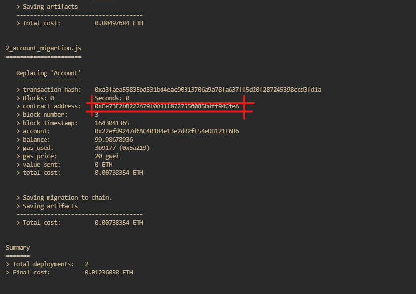

# Extrimian - Dapp

    

## Introducción

Este proyecto es una Dapp (Aplicaciones descentralizadas) que se comunica con un smart contract desplegado en una red testnet blockchain ethereum (https://rinkeby.etherscan.io/).

El proyecto se conecta con la cuenta de Metamask de la persona que usa la página web para poder mostrar las primeras 10 transacciones realizadas con la cuenta, las transacciones las obtiene de la API Rinkeby. La app guarda en la blockchain la cuenta y la cambia al conectar una cuenta nueva.

## Tecnologías utilizadas

Para realizar el proyecto se utilizaron las siguientes tecnologías:

* [TypeScript](https://www.typescriptlang.org/)
* [Node.js](https://nodejs.org/)
* [Ethers.js](https://docs.ethers.io/v5/)
* [React](https://reactjs.org/)
* [Scss](https://sass-lang.com/)
* [Truffle](https://truffleframework.com/)
* [Ganache](https://trufflesuite.com/ganache/)
* [Solc](https://docs.soliditylang.org/en/v0.8.11/installing-solidity.html)
* [Solidity](https://solidity-es.readthedocs.io/es/latest/)
* [Git](https://git-scm.com/)

## Diagrama de alquitectura

    

## Pasos para utilizar la Dapp

Para el correcto funcionamiento de la Dapp se debe tener instalado Truffle, Ganache y Solc. Además de una cuenta en Metamask.

Para instalar truffle y solc:

    npm install -g truffle solc
    o
    yarn global add truffle solc

Descargar e instalar [Ganache](https://trufflesuite.com/ganache/).

En la carpeta truffle hay que compilar el proyecto con:

    cd truffle
    truffle compile

Luego hay que abrir Ganache y hacer clic en “QuickStart”. Hay que deployar el contrato con:

    truffle deploy --network development

Seguido de esto en la consola un mensaje como el siguiente, se debe copiar la dirección del contrato y guardarla en un archivo llamado ".env" en la ruta ./client/

    

En el archivo ".env" se debe agregar la siguiente linea:

    REACT_APP_CONTACT_ADDRESS=0xEe73F2bB222A7910A3118727556085bdff94CfeA

Luego en la carpeta client hay ejecutar el comando start en la consola:

    npm start 
    o
    yarn start

Se abrirá la página web en la dirección: [localhost:3000](http://localhost:3000/)

    

Para conectar la cuenta de Metamask a la Dapp se debe hacer clic en el botón que dice "Connect Wallet" y aparecerán las primeras 10 transacciones realizadas con la cuenta.

    

Si se quiere sacar la cuenta de la página y resetear a la cuenta por defecto, se debe hacer clic en el botón que dice "Reset Wallet".

    

## Link del Repositorio

[Github](https://github.com/ArenasAgustin/extrimian-dapp)
